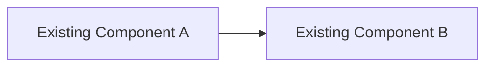
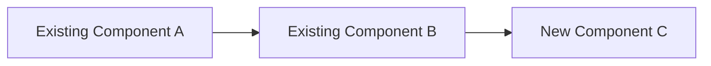

# Spec Template

Use this structure for the final spec document. Collapse optional sections for
small tasks, but keep scope, criteria, and verification explicit.

The `Scope` section is machine-read: `.pi/extensions/lib/spec-scope.ts` parses its
`**Modify:**` and `**Forbid:**` lists into the write boundaries the guard enforces.
Reformatting that section — a different heading level, renamed labels, a table instead
of lists — changes what the guard allows, with no compile error. Change the parser too.

```md
# Spec: {Feature Name}

> Generated on {date}
> Status: Draft | In Review | Approved
> Size: Small | Medium | Large | Epic

> Implementation Guard: If `Open Questions / Deferred Decisions` contains any unanswered item, implementation is blocked. Any AI coding agent must stop, ask the user to answer those items, and wait before changing code, config, migrations, tests, or docs.

## 1. Intent
One paragraph for what changes and why now.

## 2. Scope

**Modify:**
- `path/to/file`

**Call:**
- `service-or-api`

**Forbid:**
- `path/or/area`

**Out of Scope:**
- ...

## 3. Acceptance Criteria

- [ ] AC1: ...
- [ ] AC2: ...
- [ ] AC3: ...

## 4. BDD Scenarios

### AC1
Given ...
When ...
Then ...

### AC2
Given ...
When ...
Then ...

## 5. Execution Steps

### Step 1: ...
- Files: `path/to/file`
- Change: ...
- Guardrails: ...

### Step 2: ...
- Files: `path/to/file`
- Change: ...
- Guardrails: ...

## 6. Invariants and Contracts

**Org invariants:**
- ...

**Domain contracts:**
- ...

## 7. CARDS Architecture Contract

- Clarity: ...
- Alignment: ...
- Resilience: ...
- Domain Integrity: ...
- Separation: ...

## 8. Architecture Impact & Data Flow Changes

> Small specs: omit this section. Medium: include 8.1 + 8.3 + 8.5. Large: all subsections.

### 8.1 Data Flow Changes

**Before:**


**After:**



**Changed Flows:**

| Flow | Before | After | Impact |
|------|--------|-------|--------|
| ... | ... | ... | ... |

### 8.2 Component Changes

```
┌─────────────┐     ┌─────────────┐     ┌─────────────┐
│   Component │────▶│   Component │────▶│   Component │
└─────────────┘     └──────┬──────┘     └─────────────┘
                           │
                      ┌────▼──────┐
                      │  New Comp │   ← NEW
                      └───────────┘
```

### 8.3 Blast Radius

**Components affected by this change:**

- Direct: `path/to/file.ts`
- Transitive: `path/to/consumer.ts` (contract unchanged)
- External: `external-service` (new dependency)

### 8.4 Dependency Changes

| Type | Component | Direction | Notes |
|------|-----------|-----------|-------|
| New | ... | A → B | ... |
| Modified | ... | Internal | ... |
| Removed | ... | A → B | ... |

### 8.5 Layer Impact

**Layers affected by this change:**

| Layer | Files Changed | What Changes | Risk |
|-------|---------------|--------------|------|
| Presentation (UI) | `src/components/LoginForm.tsx` | New input field + validation | Low — isolated UI change |
| Business Logic | `src/services/auth.service.ts` | New validation rule | Medium — affects all login flows |
| Data Access | `src/repositories/user.repo.ts` | New query parameter | Low — additive change |
| Infrastructure | `docker-compose.yml` | New Redis service | High — runtime dependency |

**Stack View:**

```
┌─────────────────────────────────────────────────┐
│  Presentation Layer  │  ✏️ LoginForm.tsx         │
│                     │  ✏️ LoginValidation.ts     │
├─────────────────────────────────────────────────┤
│  Business Logic    │  ✏️ auth.service.ts        │
│                   │  ➕ cache.strategy.ts       │
├─────────────────────────────────────────────────┤
│  Data Access       │  ✏️ user.repo.ts           │
│                   │  ➕ cache.repo.ts           │
├─────────────────────────────────────────────────┤
│  Infrastructure    │  ✏️ docker-compose.yml     │
│                   │  ✏️ env.config.ts          │
└─────────────────────────────────────────────────┘

Legend: ✏️ Modified  ➕ New  ➖ Removed  ⚠️ Breaking
```

**Unchanged Layers:**

- Database Schema (no migration required)
- External APIs (contract unchanged)

## 9. Verification Plan

### 9.1 Automated Verification Matrix

| Criterion | Check Type | Command / System | Expected Evidence |
| --- | --- | --- | --- |
| AC1 | Unit | `npm run test -- ...` | ... |
| AC2 | Integration | `...` | ... |

### 9.2 Manual Verification Checklist

- [ ] Step 1: command/input -> expected result
- [ ] Step 2: command/input -> expected result

### 9.3 Regression Checks

- [ ] Existing tests: `...`
- [ ] Existing flows unchanged: `...`

## 10. Risks, One-Way Doors, Rollback

| Risk | Severity | Mitigation | One-Way Door | Rollback |
| --- | --- | --- | --- | --- |
| ... | High | ... | Yes/No | ... |

## 11. Traceability and Audit

- Source ticket/PRD: ...
- Reviewer/approver: ...
- Link acceptance criteria to verification artifacts.

## 12. Definition of Done

- [ ] Scope boundaries respected (`modify/call/forbid`).
- [ ] CARDS architecture contract respected or explicitly waived.
- [ ] All acceptance criteria pass.
- [ ] Verification evidence captured.
- [ ] Risks and rollback documented.

## 13. Open Questions / Deferred Decisions

If this section has any unanswered item, implementation must not start.

- [ ] ...

## 14. Handoff

- Implementation agent should read: `...`
- Implementation blocked: Yes/No. If yes, stop and prompt the user to answer `Open Questions / Deferred Decisions` before making changes.
- Verifier should validate: `...`
- Escalation triggers: `...`

```

Use short sections for small changes. Keep criteria and checks measurable.
