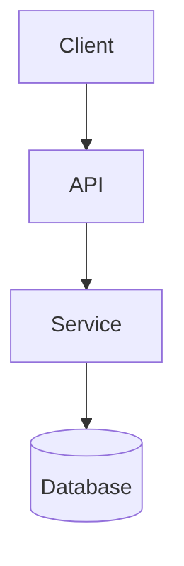

# Plan Template

Use this structure for the final plan file. Collapse sections that are not
needed for small tasks, but keep phase boundaries, testing guidance, review
checkpoints, and token-efficiency notes explicit.

```md
# Plan: {Feature Name}

> Generated on {date}
> Status: Draft | In Review | Approved
> Size: Small | Medium | Large | Epic

## Summary
One paragraph describing the goal and the minimal-change approach.

## Architecture Overview
> Optional. Include when the plan introduces major structural changes (new service, new data flow,
> significant module restructuring, API surface change, schema migration) or when the user requests one.
> Use Mermaid for best compatibility with GitHub/GitLab markdown rendering.
> For changes to an existing flow, provide Before and After diagrams.

<!-- Example: data/request flow -->


## Scope

**Included:**
- ...

**Excluded:**
- ...

## References
- User resources:
- Related code:
- Related tests:
- Prior plans/specs:

## Detected Project Context
- Language/Framework:
- Test Framework:
- Build/Run Commands:
- CI/CD:
- Deployment Target:
- Relevant AI Instructions:

## Risks & Dependencies

| #   | Risk | Severity             | Mitigation | One-Way Door? |
| --- | ---- | -------------------- | ---------- | ------------- |
| 1   | ...  | Critical/High/Medium | ...        | Yes/No        |

**Blockers** (must be resolved before implementation):
- ...

---

## Phase {N}: {Phase Name}

### Goal
One sentence describing what this phase achieves.

### Tasks

#### Task {N}.{M}: {Task Name}
**Files to modify**: `path/to/file`
**Files to create**: `path/to/new_file`

**Spec**:
- Behavior: ...
- Edge cases: ...

**Definition of Done**:
- [ ] ...
- [ ] ...

### Testing

#### Automated Tests
- [ ] Unit: ...
- [ ] Integration: ... (if requested)

**Run with**: `...`

#### Manual Verification
1. ...
2. ...

**Expected result**: ...

**Regression check**: `...`

### Context for Implementation

> Token-efficiency notes for the coding agent.

- **Read first**: `path/to/main_file`, `path/to/related_test`
- **Can skip**: `path/to/unrelated_module`
- **Patterns to follow**: See `path/to/similar_feature` (lines X-Y)
- **Reuse**: `import {helper} from path/to/utils`

### Review Checkpoint
> Stop here. Review the completed work for this phase, run tests, and
> verify manually before moving on.

---

## Summary of All Changes

| File | Change type | Phase |
| ---- | ----------- | ----- |
| ...  | ...         | ...   |

## Manual Test Checklist
> Consolidated end-to-end checklist for a tester or reviewer to sign off on the full implementation.
> Covers all phases in sequence. Each item is specific: exact command, URL, input, and expected result.

<!-- Phase 1: {Phase Name} -->
- [ ] ...
- [ ] ...

<!-- Phase 2: {Phase Name} -->
- [ ] ...
- [ ] ...

## Open Questions / Deferred Decisions

| #   | Question | Owner | Blocking? |
| --- | -------- | ----- | --------- |
| 1   | ...      | ...   | Yes/No    |

## Handoff

- **Implementation**: Use `$tdd-coding` to implement each phase in TDD order.
- **Review** *(large or risky plans)*: Use `$grill-me` to stress-test this plan before implementing.
- **Integration tests**: During implementation, the TDD skill will ask about integration test input/output pairs.


| File               | Action | Phase | Notes |
| ------------------ | ------ | ----- | ----- |
| `path/to/file`     | Modify | 1     | ...   |
| `path/to/new_file` | Create | 1     | ...   |

## Open Questions & Deferred Decisions
- [ ] ...

## Handoff

- **Implementation**: Use `$tdd-coding` to implement each phase in TDD order.
- **Review** (optional): Use `$grill-me` to stress-test this plan before starting.
- **Integration tests**: During implementation, the TDD skill will ask about input/output pairs.
```

## Open Questions

- ...

## Token Efficiency Notes

- Start with these files:
- Reuse these patterns:
- Skip these unrelated areas unless new evidence appears:

```

For large tasks, repeat the phase section as needed and optionally add separate
phase documents or supporting specs when the user asks for them.
